# Manual de usuario automatización de CxS_P2.

## Indicaciones previas de parametrización adicionales. 
Análogamente la proceso orignal del CXS_se hará uso del IDLE de python para la ejecución de la automatización. 

Antes de llevar a cabo la ejecución debemos parámetrizar 3 aspectos fundamentales, únicamente relacionados con la ejecución del proceso.

### 1. Meses a actualizar. 
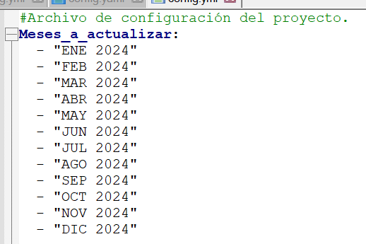

Contiene un diccionario con todos los meses posibles. Se debe selecionar la cantidad de meses a actualizar por medio de los nombres correspondientes.
Se pueden presentar los siguientes casos para la actualización. 

#### Caso 1. Año completo:  
Debemmos dejar el parámetro tal y como está en la imagen antirior. (Actualizando el año en curso.)

#### Caso 2. Año parcial:

Introducimos solos los meses deseados así. 

**Ejemplo 1**

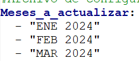

**Ejemplo 2**

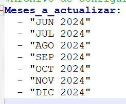

#### Caso 3. Meses individuales:

Unicamente introducimos el mes de nuestro interes. 

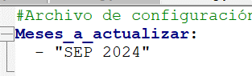

#### Caso 4. Meses especificos.

En concreto solo los meses que deseamos sea la cantidad y el orden deseado. 

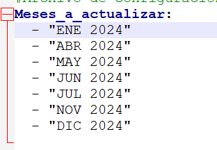

---
### 2. Meses del año. 

Para este caso solo es requerido actualizar en el diccionario el año actual en curso para el cual se corre la automatización. 

----

### 3. Ruta Insumo_cxs_dinamico.db

Ruta completa sin comillas donde se encuentra el archivo de Insumos db, solo se debe copiar y pegar la ruta de la carpeta donde se tenga este archivo

**Ejemplo**

**Notemos que esta es la ruta de la carpeta donde tenemos nuestro archivo (*.db ) no incluye el nombre del archivo en la ruta.** 

---

# Indicaciones de Ejecución

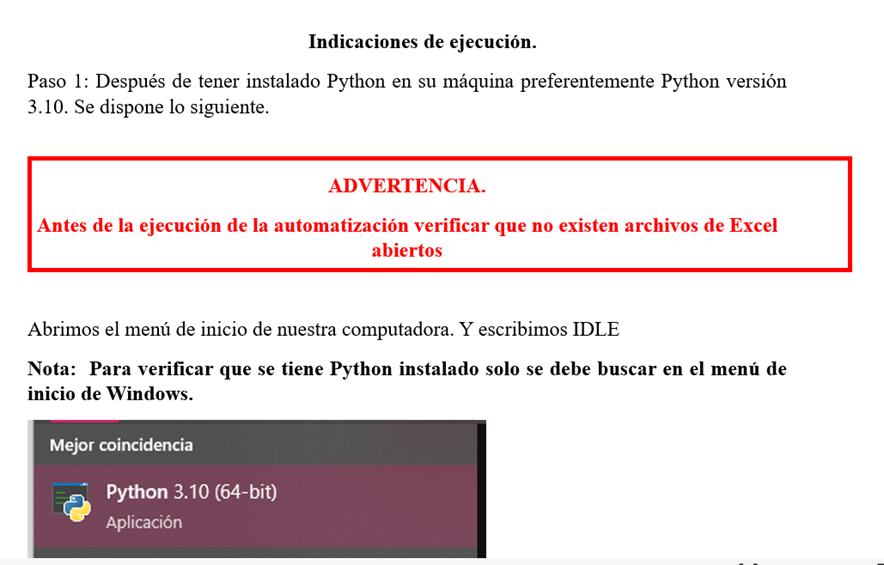

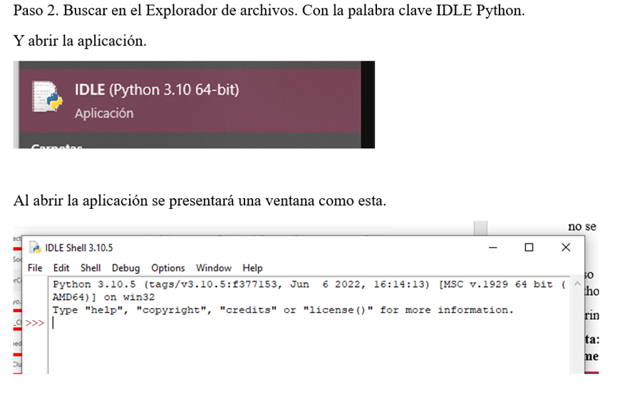

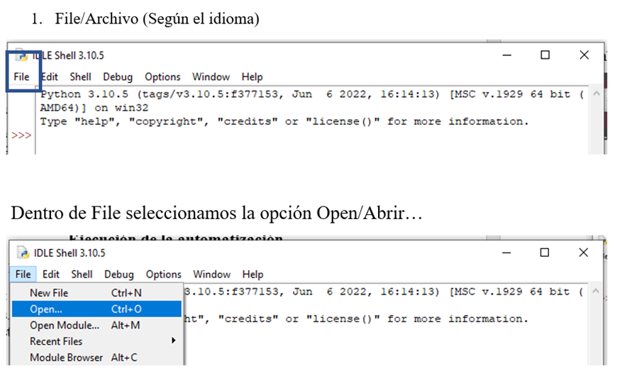

Esto nos llevara al explorador de archivos y debemos ir a la carpeta donde tenemos el archivo + todos los insumos que se necesitan.

Abrimos el archivo main.py dentro de la carpeta Scripts 

Esto nos llevara al explorador de archivos y debemos ir a la carpeta donde tenemos el archivo + todos los insumos que se necesitan.

**Dentro de la carpeta Scripts**

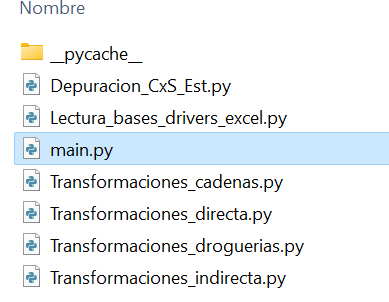

Abrimos (Damos/click) al archivo main.py, luego obtendremos la siguiente ventana. 

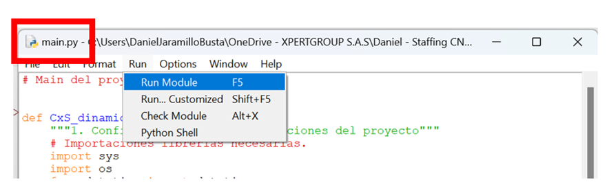

Debemos verificar que en la parte superior nos indique main.py. Luego, para ejecutar el proceso nos vamos a la pestalla superior "Run" y dando click en la opción "Run Module" Y no aparecerá la siguiente instrucción. 

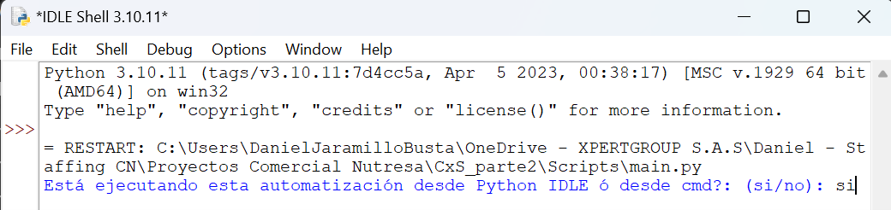

**"OJO" Por defecto debemos escribir siempre si, como vemos en la siguiente imagen, y luego presionar la tecla Enter**

Así inicia la ejecución del proceso.

Y solo queda esperar que ejecute. 

**El proceso anterior al finalizar mostrará el tiempo final y el simbolo: >>> así:

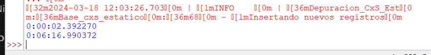

Proceso finalizado. 