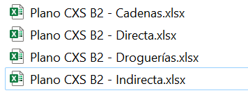
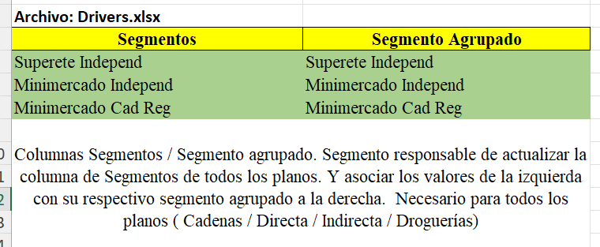
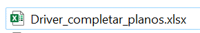
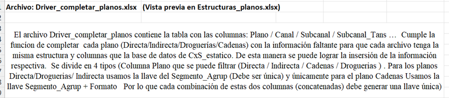
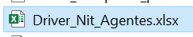
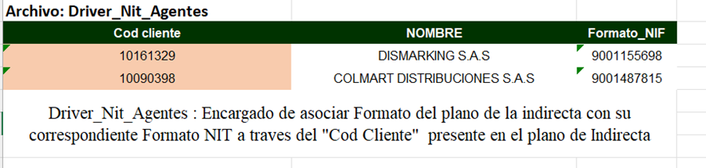
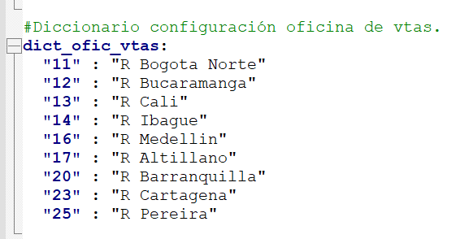
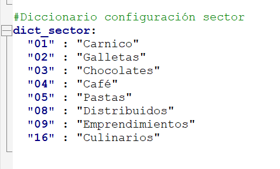

# Tabla de Contenido

[introduccion](#Introduccion)
   1.1 [Glosario](#Glosario-de-terminos)
   1.2 [Consultas](#Lista-de-planos-para-la-automatizacion-de-Comercial-Nutresa)
   1.3 [Objetivo](#objetivo-de-la-automatizacion)
   1.4 [Etapas_de_desarrollo](#etapas-del-desarrollo-del-proceso-de-CxS_parte2)
   1.6 [Aclaraciones](#aclaraciones)
   
[Archivos_necesarios_para_la_automatizacion](#archivos-necesarios-para-la-automatización)
   2.1 [Planos](#Lista-de-planos-para-la-automatización)
    2.1.1 [Recomendaciones_planos](#recomendaciones-planos)
    2.1.2 [Ubicacion_de_las_planos_de_ventas.](#ubicacion-de-los-planos-de-ventas-y-descuentos)
   2.2[Drivers](#drivers)
    2.2.1[Driver](#driver)
    2.2.2[Dirver_completar_planos](#driver_completar_planosxlsx)
    2.2.3["Driver_nit_agente](#driver_nit_agentexlsx)
    2.2.2[Recomendaciones y obligaciones para la manipulación de los Drivers.](#recomendaciones-y-obligaciones-drivers)
    2.1.2 [Ubicacion_de_los_drivers.](#ubicacion-de-los-drivers)
   2.3.1[Estructura_planos](#estructura-de-las-planos-de-información)
   2.3.2[Estructura_Drivers](#estructura-de-los-drivers-de-información)
   2.3.3["Estructura_y_desglose_resumen](#estructura-y-desglose-resumen)

3. [Archivo_config.yml](#archivo-configyml)
   2.2 [Visualizaciones](#Visualizaciones-del-archivo-(config_yml))
   3.3 [Parametrizaciones_posibles](#parámetrizaciones-posibles)
   3.4 [Modificaciones-básicas-de-los-parámetros-de-configuración.](#modificaciones-básicas-de-los-parámetros-de-configuración)
   3.8 [Adicional_NO_modificables](#listas-de-información-adicionales-no-modificables)
   3.9 [Auxiliares_modifcables](#auxiliares-modificables-en-archivo-configyml)

4. [BD_CXS_Estatico](#bd_cxs_estatico)

5. [Responsables](#responsables)

6. [Manual_de_usuario](#enlace-al-manual-de-usuario)

# Proyecto de CxS (Costo por Servil) Parte 2

## Introducción
Este manual contiene toda la información necesaria para el buen uso del asistente del proceso "Automatización de  CxS_P2". Además, se incluye una descripción detallada de archivos, procedimientos e instrucciones sobre el contenido del ejecutable y la estructura de los archivos finales, entre otros.

## Glosario de terminos

| **Término** | **Definición** |
|-------------|----------------|
| **Consultas de información** | Las consultas son las fuentes de información principales, contienen toda la información de relacionada la CXS_P2. En esencia se refieren a archivos del tipo xlsx o csv, que serán cargados procesados y cargados en memoria con diferentes funciones. Se divide en 4 categorías: Plano CXS Directa, Indirecta, Droguerías y Cadenas. Cada consulta contiene un tipo especifico de clientes de CN, y a su vez; a cada consulta se le hacen modificaciones y transformaciones para prepararlas antes de consolidarlas en el insumo del CXS_P2. |
| **Drivers** | En este contexto de trabajo, un driver tiene un significado similar a una consulta. Son las fuentes de información adicionales, contienen toda la información de relacionada el CXS_P2. En esencia se refieren a archivos del tipo xlsx o csv, que serán cargados procesados y cargados en memoria con diferentes funciones. Estos son los archivos auxiliares, modificables, y parametrizables que sirven para modificar principalmente los datos, más no las estructuras de las consultas. |
| **Automatización CXS_P2** | El proceso de CXS_P2 es un asistente que utiliza información de múltiples fuentes de la compañía Comercial Nutresa. De los dos tipos de atención conocidos (Directa e Indirecta), se emplea información de tres consultas de clientes en diferentes etapas conocidas como plantillas. |
| **CXS_P2** | Proceso que genera todas las plantillas necesarias, para actualizar la base de datos del CXS, tanto en los Centros de Costo definidos como en los Centros de Costo del tipo #/#. En la categoría de Tipo "Presupuesto". El proceso permite de manera eficiente recopilar los datos necesarios para el correcto funcionamiento de este proceso en CN. |
| **Centros de Costo** | También llamados Cecos, son clasificaciones donde se cargan todos los gastos operativos y no operativos, que conlleven un costo cuantificable y que se agrupan con el fin de, valga la redundancia, tener un panorama sobre costos, operativos, funcionales, logísticos, nominales y demás dentro de Comercial Nutresa. |

## Objetivo de la automatización
El objetivo se centra en actualizar la base de datos del CxS. Se actualizaran los valores númericos. dados por las columnas: 

      - Ventas_Efectivas
      - Descuentos
      - Gasto_Prom_Comercializadores
      - Descuentos_NG
      - Depuracion_Dctos
      - Dctos_Grupo
      - Ventas_Efectivas_Grupo
      - Descuentos_CN
      - Ventas_Netas_CN
      - Ventas_Netas_Grupo
      - Devoluciones_malas
      - Ventas_Efectivas_Final
      - Total_Gastos_CN

Las columnas en la lista anterior se actualizan de diferente forma dependiendo de un tipo de Centro de Costo especifico los cuales se dividen en: 

### 1.) Centro_Costo #/#
Registros de la base de datos cuyo Centro_Costo = "#/#
Los registros se actualizan utilizando los planos: 
- Plano CXS B2 - Cadenas.xlsx 
- Plano CXS B2 - Directa.xlsx
- Plano CXS B2 - Droguerías.xlsx
- Plano CXS B2 - Indirecta.xlsx 

   ### Columnas que actualiza:

      - Ventas_Efectivas
      - Descuentos
      - Gasto_Prom_Comercializadores
      - Descuentos_NG
      - Depuracion_Dctos
      - Dctos_Grupo
      - Ventas_Efectivas_Grupo
      - Descuentos_CN
      - Ventas_Netas_CN
      - Ventas_Netas_Grupo
      - Devoluciones_malas
      - Ventas_Efectivas_Final
      

### 2.) Centros_Costo (*NO*) #/#
Registros de la base de datos cuyo Centro_Costo != "#/#

Los registros se actualizan utilizando una base de datos auxiliar que se trata como un insumo: La base de datos se conoce como **DistribucionCXS.db** 

   ### Columnas que actualiza
      - Total_Gastos_CN
   

### Archivo de actualización. 
El archivo de base de datos sql, sobre el cual se realizan los cambios: **Insumo_cxs_dinamico.bd**

## Etapas-del-desarrollo-del-proceso-de-CxS_parte2

| Etapa | Descripción |
|---|---|
| Lectura y procesamiento inicial | Se leen y cargan en memoria los archivos de insumo. (Drivers / Planos / Archivos.db,  todos ubicados en la carpeta insumos y sus subcarpetas.)
| Limpieza y transformación de datos | Se limpian y transforman los diferentes insumos según los requerimientos |
| Creación de drivers | Con base en la información de diferentes insumos se consolida la información correspondiente en un driver que sirven como apoyo para la automatización
| Cálculo de columnas adicionales | Se calculan columnas adicionales con la información disponible. Con base en información que tenemos dentro de los planos modificados y refinados anteriormente. |
| Adición de datos | Se agregan las nuevas columnas calculadas a los planos originales. |

  
## Aclaraciones

- El proceso de CxS parte 2 tiene como objetivo la modificación de la Base del CXS, generada por la primera parte de esta automatización. Se modifica de dos formas como se aclaró anteriormente. De acuerdo al tipo de centro de Costo. Sea #/# o un Centro de Costo definido (Ejm: GNCH/43000900).
- Esta automatización modificara la información para los centros de costo del tipo #/# , y en todo lo referente a valores de ventas, descuentos y cesantias.

  

# Archivos necesarios para la automatización.

**Nota: Las siglas (NP) se refieren a nombre parámetrizable, es decir, manipulable el nombre del archivo que se debe actualizar posteriormente en el archivo config.yml**

## Lista de planos para la automatización 

#### **Plano CXS B2 Cadenas.xlsx**

- **Hoja necesaria:**  (NP) 
  - Plano Cadenas
- **Driver necesario:**  (NP) 
  - Drivers.xlxs
- **Insumo generado:** (NP)
  - Plano Cadenas ( Modificación del mismo.)
-  **Tipo de archivo:** Archivo de Excel
- **Formato de archivo:** Archivos Dinámicos / No contiene macros
- **Macros necesarias para el proceso:** Ninguna

#### **Plano CXS B2 Directa.xlsx**

- **Hoja necesaria:**  (NP) 
  - Plano Directa
- **Driver necesario:**  (NP) 
  - Drivers.xlxs
- **Insumo generado:** (NP)
  - Plano Directa ( Modificación del mismo.)
-  **Tipo de archivo:** Archivo de Excel
- **Formato de archivo:** Archivos Dinámicos / No contiene macros
- **Macros necesarias para el proceso:** Ninguna

#### **Plano CXS B2 Indirecta.xlsx**

- **Hoja necesaria:**  (NP) 
  - Plano Directa
- **Driver necesario:**  (NP) 
  - Drivers.xlxs
- **Insumo generado:** (NP)
  - Plano Directa ( Modificación del mismo.)
-  **Tipo de archivo:** Archivo de Excel
- **Formato de archivo:** Archivos Dinámicos / No contiene macros
- **Macros necesarias para el proceso:** Ninguna

#### **Plano CXS B2 Droguerías.xlsx**

- **Hoja necesaria:**  (NP) 
  - Plano DR
- **Driver necesario:**  (NP) 
  - Drivers.xlxs
- **Insumo generado:** (NP)
  - Plano Droguerías ( Modificación del mismo.)
-  **Tipo de archivo:** Archivo de Excel
- **Formato de archivo:** Archivos Dinámicos / No contiene macros
- **Macros necesarias para el proceso:** Ninguna

#### **Base_datos.db**

- **Tabla necesaria :**  (NP) 
  - Insumo_cxs
- **Insumo generado:** (NP)
  - Base_datos.db ( Modificación de la misma.)
-  **Tipo de archivo:** Archivo.db 
- **Formato de archivo:** Archivos Dinámicos.
- **Lenguaje DB Utilizado** SQL
- **Software_auxiliar** BD Browser (SQLite)

### Recomendaciones planos.

<ul id="requisitos">
  <li>No mover ni sacar de la carpeta insumos</li>
  <li>No eliminar ninguno de los archivos anteriormente descritos (solo modificarlos en nombre del archivo y/o nombre de la hoja.)
  <li>Verificar que la extensión siempre sea la misma .xlsx</li>
  <li>No cambiar el nombre a la carpeta anterior (Insumos) Ni cambiar su ubicación</li>
  <li>No cambiar el nombre de las carpetas dentro de ella. (Drivers) / (DB)</li>
  <li>En caso de querer cambiar el nombre (Del archivo o la hoja) cambiar el parámetro (Luego se explicará cómo hacerlo.)</li>
  <li>No agregar a la carpeta archivos adicionales con los mismos nombres que puedan generar conflictos en la automatización.</li>
  <li>Si se desea cambiar el nombre de los archivos se debe hacer parametrizándolos. Proceso que se explicará más adelante en las modificaciones del config.yml.</li>
</ul>

## Ubicacion de los planos de ventas y descuentos.

## Drivers.
Estos son los archivos auxiliares, modificables, y parametrizables que sirven para modificar principalmente los datos, más no las estructuras de las planos de ventas (Cadenas , Directa, Indirecta y Droguerias). Se dividen en **Driver_completar_planos.xlsx, Driver_Nit_Agentes.xlsx y Drivers.xlsx**. Es preciso señalar, que los drivers no son excluyentes entre sí, es decir, ciertas modificaciones en los planos requieren de la interferencia e información añadida y parametrizada en 1, 2 o los **3 drivers**.

Por lo tanto, es necesario para la automatización que los 3 se encuentren en la carpeta correspondiente, debidamente diligenciados para obtener los resultados esperados. Dentro de cada driver, En el archivo Drivers y utilidad se encuentra una explicación de la utilidad de cada uno de los drivers auxiliares de información. el usuario puede modificar los drivers cada vez que quiera en términos de datos, **pero en ningún caso en términos de estructura y organización ya que esto repercute en el desarrollo de la automatización**. Es igual de importante mantener la estructura de los drivers como de las correspondientes consultas de información.

## Drivers.xlsx

* **Tipo de archivos:** Archivo de Excel.
* **Formato del archivo:** Archivos Dinámicos / No contiene macros.
* **Macros necesarias para el proceso:** Ninguna
* **Consultas impactadas en el proceso:** (Planos impactados en el Proceso: Todos )
* **Extensión del archivo:** xlsx
* **Hoja Necesaria:** (A parametrizar)

* **Visual del Driver:**

#### Contenido 
#### Parte 1 Drivers.xlsx + Explicacion.

#### Parte 2 Drivers + Explicacion.

## Driver_Completar_planos.xlsx

* **Tipo de archivos:** Archivo de Excel.
* **Formato del archivo:** Archivos Dinámicos / No contiene macros.
* **Macros necesarias para el proceso:** Ninguna
* **Consultas impactadas en el proceso:** (Planos impactados en el Proceso: Todos )
* **Extensión del archivo:** xlsx
* **Hoja Necesaria:** (A parametrizar)

* **Visual del Driver:**

#### Driver_completar_planos.xlsx Explicacion.

## Driver_Nit_Agente.xlsx

* **Tipo de archivos:** Archivo de Excel.
* **Formato del archivo:** Archivos Dinámicos / No contiene macros.
* **Macros necesarias para el proceso:** Ninguna
* **Consultas impactadas en el proceso:** (Planos impactados en el Proceso: Todos )
* **Extensión del archivo:** xlsx
* **Hoja Necesaria:** (A parametrizar)

* **Visual del Driver:**

#### Driver_Nit_Agente.xlsx  +Explicacion.

--- 

### Ubicacion de los drivers.

### Recomendaciones y obligaciones Drivers.
<ul>
    <li>No mover los archivos de la carpeta "Insumos".</li>
    <li>No eliminar ninguno de los 3 archivos mencionados anteriormente (solo se pueden modificar en nombredelarchivo y/o nombre de la hoja)</li>
    <li>Verificar que la extensión del archivo siempre sea la misma (.xlsx).</li>
    <li>No cambiar el nombre de la carpeta anterior ("Insumos")ni cambiar su ubicación.</li>
    <li>Se recomienda dejar el nombre de la carpeta Drivers , de los archivos "Driver_completar_planos.xlsx", "Driver_Nit_Agentes.xlsx" y "Drivers.xlsx" tal como estan.</li>
    <li>En caso de querer cambiar elnombre del archivo o de la hoja,cambiar el parámetro según las instrucciones proporcionadas posteriormente.</li>
    <li>No agregar archivos adicionales a la carpeta con los mismos nombres que puedan generar conflictos en la automatización.</li>
    <li>Si se desea cambiar el nombre de los archivos, sedebe hacer parametrizándolos siguiendo el proceso que se explicará más adelante.</li>
    <li>Respetar los nombres de las columnas de cada archivo y mantener la estructura para facilitar la parametrización y reconocimiento fácil.</li>
    <li>Para consultar la estructurade los drivers, se proporcionauna visualización de las columnas utilizadas. Para ver la estructura completa y correcta, consultar "Estructura_planos.xlsx" dentro de la carpeta de documentación.</li>
    <li><b>Es importante tener encuenta que puede haber nombres repetidos de columnas en los drivers, y esto no debe cambiarse en ninguna columna (nombres de sus columnas).</b></li>
    </ul>

## Estructura de las planos de información. 
Se recomienda no preocuparse por las columnas que se le  adicionaran en el proceso a los planos, revisar el archivo Estructura_planos_drivers.xlsx para poder conocer el formato, estructura y nombres de las columnas que debe tener de base cada plano. Las modificaciones posteriores son trabajo y fin de la automatización 

Para verificar la estructura necesaria de cada plano de información y las demás, siga estos pasos:

1. Dirijase a la ruta `CxS_parte2/Documentacion`

2. Abra el archivo `Estructura_planos_drivers.xlsx`.

3. Consulte la hoja `Estructura_planos` para obtener información sobre la estructura de la consulta.

4. Consulte la hoja `Estructura_drivers` para obtener información sobre la estructura de la consulta.

## Estructura de los Drivers de  información. 
Se recomienda no preocuparse por las columnas que se le  adicionaran en el proceso a las driver, revisar el archivo Estructura_Drivers.xlsx para poder conocer el formato, estructura y nombres de las columnas que debe tener de base cada driver. Las modificaciones posteriores son trabajo y fin de la automatización 

Para verificar la estructura necesaria de cada plano de información y las demás, siga estos pasos:

1. Dirijase a la ruta `CxS_parte2/Documentacion`

2. Abra el archivo `Estructura_planos_drivers.xlsx`.

3. Consulte la hoja `Estructura_drivers` para obtener información sobre la estructura de la consulta.
---

## Estructura y Desglose (Resumen)

* **Planos** 
1. Plano CXS B2 - Cadenas.xlsx
2. Plano CXS B2 - Indirecta.xlsx
3. Plano CXS B2 - Droguerías.xlsx
4. Plano CXS B2 - Directa.xslx

* **Drivers**
1. Drivers.xslx
2. Driver_completar_planos.xlsx
3. Driver_Nit_Agentes.xlsx

Estos son los nombres registrados en el archivo config.yml actualmente en funcionamiento a la fecha de entrega del manual. Los nombres como se ha dicho en este documento a fin de manejar un estándar, podrían mantenerse de esta manera y así ahorrar tiempo en temas de parametrización de los archivos.

--- 

## Archivo (config.yml)

* **Tipo de archivo**  Archivo yml (De parámetros)
* **Formato del archivo** (yml) (Formato especial de archivo de texto para parametrizar)

---

### Visualizaciones del archivo (config_yml) 
`Diferentes visualizaciones del mismo archivo "no exactas solo el tipo de vista"` 

Las anteriores son visualizaciones para trabajar el **config.yml** visualizaciones estandar sobre como se veria el archivo presente para la configuración la automatización. Dichas visualizaciones corresponden a los programas.**No a información exacta y precisa.** 

#### Editor de código (USO NO RECOMENDADO) 

#### Block de notas (USO NO RECOMENDADO) 

#### Notepad++ (USO RECOMENDADO)

--- 

## Parámetrizaciones posibles.

### Planos / Nombres / Hojas. 
Para todos los planos (Directa/Indirecta/Cadenas/Directa) podemos modificar el nombre respectivo y las hojas se sigue el siguiente esquema. 

### Parametros fijos.
1.	El nombre del plano.
2.	El nombre de la hoja u Hojas de Excel que vamos a utilizar. 
3.	El numero de columnas que posee cada plano.
4. Las columnas necesarias para cada plano. 

Estos tres parámetros están identificados como: 

Similarmente para cada plano: 

#### Plano Cadenas 

#### Plano Indirecta

#### Plano Droguerias.

## Modificaciones básicas de los parámetros de configuración. 

### NO modificable 

#### 1. Planos
| Parámetro         | ¿Es valido modificar?  |
|-------------------|------------------------|
| nom_base          | SI                     |
| nom_hoja          | SI                     |
| cols              | NO                     |
| cols_necesarias   | NO                     |
| cols_para_agregar | NO                     |

**A pesar de ser posible no es recomendado hacerlo y es preferible manejar toda la información con los nombres genéricos ya definidos para este documento**

### Auxiliares modificables en archivo "config.yml"

Los siguientes diccionarios de información presentes en el archivo "config.yml" son bastante estables pero pueden ser suceptibles a modificaciones, según se requeria con con cambios de información **Es preciso señalar, que cualquier cambio en el archivo de configuración diferentes a los descritos en este archivo de documentación y / o en el posterior manual de uso pueden conllevar a fallas en la automatización. Se debe ser muy riguroso en este sentido**

### Diccionario de meses_meses-año

### Diccionario oficina de ventas

### Diccioanrio oficina de ventas agrupada

### Diccionario sector

Demas información modificable, se realiza previo a la ejecución de la automatización, por lo que está descrita y consignada en el correspondiente manual de usuario.  (Enlace al final del documento )

## BD_CXS_ESTATICO

Esto hace referencia al archivo (*.db ) generado por la automatización del CxS_Estatico, ligada y de la cual este proceso es dependiente. Se trata de un archivo (*.db ) que contiene la tabla del cxs antes de la modificaciones del Cxs dinámico. 

### Consideraciones archivo (*.db)

El archivo (Insumo_cxs_dinamico.db) viene primeramente como resultado de la automatización del CxS estático. Al correr esta automatización, se sobreescribe (elimina e inserta información), de acuerdo con los parámetros presentes en los planos de información (Cadenas/Directa/Indirecta/Droguerias.) 

### Ruta archivo Insumo_cxs_dinamico en  "config.yml"
Dado que el archivo puede ser sobreescrito muchas veces, con la información actualizada de planos de información, se utiliza una ruta dinámica. Se explicará su uso en el manual de usuario. 

#### Estructura_básica.

Por recomendación no debe ser alterado ninguno de los parámetros. Tanto la automatización anterior, como la presente están diseñadas para conservarlos a lo largo del tiempo. 

---
---

## Responsables
### Provededor - XpertGroup.
* Daniel jaramillo Bustamante - daniel.jaramillo@xpertgroup.co

### Receptor - Comercial Nutresa.
* **Aréa TI:**
    * Sebastián Caro Aguirre scaro@comercialnutresa.com.co

## Enlace al manual de usuario. 
[Manual de Usuario](ManualDeUsuario.md) 

